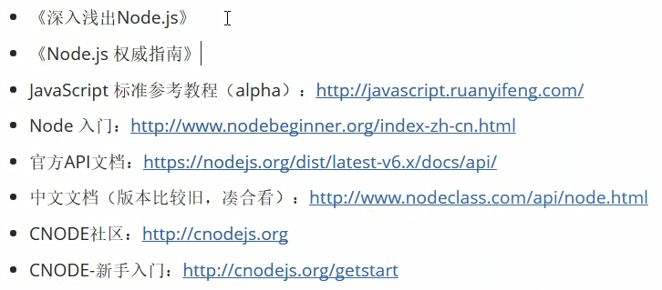

# Node.js是什么?
- Node.js 不是一门语言
- Node.js 不是库、不是框架
- >Node.js 是一个 JavaScript 运行时环境
  + 简单来讲就是 Node.js 可以解析 JavaScript 代码
  + 以前只有浏览器可以解析执行 JavaScript 代码
  + 也就是说现在 JavaScript 可完全脱离浏览器来运行，一切都归功于Node.js
  
- 浏览器中的 JavaScript 
  + EcmaScript
    * 基本的语法
    * if
    * function
    * Object
    * Array
    * var
  + BOM
  + DOM
- Node.js 中的 JavaScript
  + **没有BOM、DOM**
  + EcmaScript
  + 在 Node 这个 JavaScript 执行环境中为 JavaScript 提供了服务器级别的操作 API
    * 例如文件读写
    * 网络服务的构建
    * 网络通信
    * http 服务器
    * 等......的处理
- 构建于 Google Chrome 的 V8 引擎之上
  + 代码只是具有特定格式的字符串而已
  + 引擎可以识别认识它，引擎可以帮我们去解析和执行
  + Google Chrome 的 V8 引擎是目前公认的解析执行 JavaScript 代码最快的
  + Node.js 的作者把 Google Chrome 中的 V8 引擎移植了出来，开发了一个独立的 JavaScript 运行时环境。

- >Node.js 的特性
  + 事件驱动
  + 非阻塞IO模型（异步）
  + 轻量和高效

- >Node.js 的 npm 
  + npm 是世界上最大的开源库生态系统
  + 绝大多数 JavaScript 相关的包都存放在了 npm 上，这样做的目的是为了让开发人员更方便的去下载使用

# Node.js 能做什么?
- WEB 服务器后台
- 命令行工具
  + npm(node)
  + gitO(C 语言)
  + hexo(node)
- 对于前端工程师来讲，接触 node 最多的是它的命令行工具
  + 自己写的很少，主要使用别人第三方的
  + webpack
  + gulp
  + npm

>Node学习的相关资料：
> 


# 正题
> ## Node 的文件操作
```javascript
//  1. 使用 require 方法加载 fs 核心模块：fs 是 file-system(文件系统) 的缩写
var fs = require('fs');

// 读取文件方法 readFile('文件路径',回调函数(错误对象,数据对象))
fs.readFile('data/hello.txt',function(error,data){
    if(error){
        console.log("失败之后error错误对象的值是："+error)
        console.log("失败之后data数据对象的值是："+data)
    }else{
        console.log("成功之后error错误对象的值是："+error)
        console.log("成功之后data数据对象的值是："+data)
    }
})

// 写文件方法 
// writeFile('文件路径','写入文件的内容',回调函数)
fs.writeFile('data/writeFile.txt','这里是写入文件writeFile',function(error){
    if(error){
        console.log(error)
    }else{
        console.log("成功了！")
    }
})
```

> ## Node 构建 http 服务器
```javascript
// 1.导入 http 核心模块
var http = require('http');

// 2.使用 http.createServer() 创建一个 Web 服务器
//      返回一个 Server 实例
var server = http.createServer();

// 3.服务器要干嘛？
//      提供服务：对 数据的服务
//      发送请求
//      接收请求
//      处理请求
//      给个反馈（发送响应）
// 注册 request 请求事件
// 当客户端请求发送过来，就会自动触发服务器的 request 请求事件，然后执行第二个参数：处理回调函数
server.on('request',function(){

// request 请求事件处理函数，需要接收两个参数
//      Request 请求对象
//          请求对象可以用来获取客户端的一些请求信息，例如请求路径
//      Response 响应对象
//          响应对象可以用来给客户端发送消息
    console.log('收到客户端的请求了！');

    //response 对象有一个 write 方法，可以给客户端发送响应消息
    // write 可以使用多次，但是最后一定要用 end() 方法来结束响应，否则客户端会一直等待
    response.write('你好！');
    response.end();//结束响应
})

// 4. 绑定端口号，启动服务器
server.listen(3000,function(){
    console.log('服务启动成功了，可以通过 http://127.0.0.1:3000 来进行访问');
});

```
# 核心模块
> Node 为 Javascript 提供了很多服务器级别的 API，这些API绝大多数，都被包装到了一个具名的核心模块中了。例如文件操作的 `fs` 模块，http服务构建的 `http` 模块,`path`路径操作模块，`os` 操作系统信息模块。


>  `require` 是一个方法
- 它的作用是用来加载模块的
- 在 Node 中模块有三种
    + 具名的核心模块，例如 fs，http
    + 用户自己编写的文件模块
    + 第三方模块
- 相对路径必须加  ./ 或者../
- 在 Node 中没有全局作用域，只有 `模块作用域`
  + 外部访问不到内部
  + 内部也访问不到外部

> `require`方法有两个作用：
> 1. 加载文件模块并执行里面的代码
> 2. 拿到被加载文件模块导出的接口对象


# Web服务器开发
- > IP地址和端口号
  + IP地址用来定位计算机
  + 端口号用来定位具体的应用程序
  + 一切需要联网通讯的程序都会占用一个端口号
  + 端口号的范围从 `0 ~ 65536` 之间
  + 在计算机中有一些默认的端口号，最好不要去使用
    * 例如http服务的：`80` 端口号
  + 我们在开发过程中使用一些简单好记的就行了，比如  `3000` 或者 `5000`,这些端口号就没有什么意义。
  + 可以同时开启多个服务，但一定要确保不同服务占用的端口号不一致才可以
    * 也就是说，在同一台电脑上，同一个端口号同一时间只能被一个程序占用

- > 在发送请求的时候，为什么会中文乱码
  1. 在服务器端默认发送的数据，其实是 `UTF-8` 编码的内容
  2. 但是浏览器不知道你是 `UTF-8` 编码的内容
  3. 浏览器在不知道服务器响应内容的编码的情况下会按照当前操作系统默认编码去解析
  4. 中文操作系统默认编码是 `GBK` ,所以你用 `GBK` 编码去解析 `UTF-8` 编码是解析不了的
### 解决方法：
> 正确的告诉浏览器我们发送的内容是什么编码的
```javascript
// 在http协议中：Conent-type 就是用来告知对方我给你发送的数据内容是什么类型
response.setHeader('Content-Type','text/plain;charset=UTF-8')
```
---

## [常用文件类型对照表](http://tool.oschina.net/commons)
----

## Node 中使用模板引擎：
```javascript
// Node中使用 art-template 模板引擎
//      1. npm 安装 art-template 第三方包
        npm install art-template
//      2. require 引入 art-template
        var art_template = require('art-template');
//      3. 使用 render 方法渲染
        art_template.render(function('内容'){
            // 放要替换的对象
            title:'个人信息',
            name:'Jack',
            age: 18,
            from : '湖南',
            hobbies: [
                '打球',
                '听歌',
                '打代码'
            ]
        })
```
```html
<!DOCTYPE html>
<html lang="en">
<head>
    <meta charset="UTF-8">
    <title>{{ title }}</title>
</head>
<body>
    <p>姓名 {{ name }}</p>
    <p>来自 {{ from }}</p>
    <p>年龄 {{ age }}</p>
    <p>爱好 {{each hobbies}} {{ $value }} {{/each}}</p>
</body>
</html>
```


